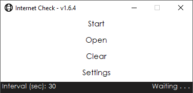
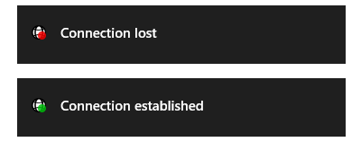

  
  

  

  

      
      
      
      
         
      
   

 
<b><i>This program periodically checks if the computer is connected to the internet and logs offline time. It can also be used to check custom servers. Ping and packet lost are not measured.</i></b>

# User Guide

- After opening the program set an **interval** in which the Internet should be checked.
- Click on **Start** to start collecting data.
- To stop the program click on **Stop**.
- Results can be viewed by clicking on **Open**.
- The current status of the application is displayed in the bottom right.
- By default the program will only show the offline time and not the time the computer is connected to the internet.
  - To change this read "show all Ping Results" in the chapter Advanced Settings.
- Results are cleared by pressing **Clear** and then either "Clear Everything" or "Clear Only Irrelevant Data".
  - Note: Make sure that the program is not currently logging data. (Status bottom right: Waiting . . .)
  - Warning: A clear can not be undone.

# Install Guide & System Requirements

1. <b>[Visit the Download page](https://github.com/Rllyyy/Internet-Check/releases/latest)</b> and <b>Download <i>Internet-Check.Setup.msi</i></b> or <b>[Download the latest version directly](https://github.com/Rllyyy/Internet-Check/releases/download/v1.6.4/Internet-Check-v1.6.4.Setup.msi)</b>
2. Start the Setup
3. If the message "Windows protected your PC" pops up, click on "More info" and then "Run Anyway"
4. Follow the instructions in the Setup
5. Start InternetCheck.exe from either the Desktop or navigate to <i>Program Files (x86)\4PointsInteractive\InternetCheck.exe </i>

  
<b><i>View System Requirements</i></b>

  

  <ul>
  <li><b>.NET Framework 4.7.2</b> (included in <b>Windows 10</b> April 2018 Update) but should also work on Windows 7+ or Windows Server 2008 R2+ </li>
  <li>Memory: 30 MB RAM</li>
  <li>Storage: 5 MB available space</li>
</ul>
  

# In-App Settings

### Basic Settings

<!--DarkMode-->

  
<b>DarkMode</b>

  <ol>
  <li><b>Tick the Checkbox "Use DarkMode".</b> The UI now switches to a darker colour pattern. </li>
  </ol>
  <i><b>Note:</b></i> The color of the title background may still appear white. These Windows settings can only be changed by the user. <a href="https://www.hellotech.com/guide/for/how-to-enable-dark-mode-in-windows-10">Here</a> is a quick guide.
  

<!--System Tray-->

  
<b>Show only in System Tray when minimized</b>

  <ol>
  <li><b>Tick the "Show only in System Tray" Checkbox</b> if you want to hide the application when minimized. </li>
  </ol>
  <i><b>Warning:</b></i> If both "Start with Windows" and "Show only in System Tray" are ticked the program is not directly visible to the user and will run in the background. It can still be accessed through the System Tray or by running the .exe again.
  

<!--Show Minimized Info-->

  
<b>Show Ballon tip when minimized</b>

  

  Set this value to false if the balloon item that shows up if the application is minimized to the system tray should not be displayed. Make sure that the focus assist is off.
  

  

  
  

<!--Windows-Start-->

  
<b>Start with Windows (Task Scheduler)</b>

  <ol>
  <li>Start the Application with admin rights.</li>
  <li><b>Tick the Checkbox "Start with Windows" in the settings menu.</b></li>
  </ol>
  <i><b>Warning:</b></i> If both "Start with Windows" and "Show only in System Tray" are ticked the program is not directly visible to the user and will run in the background. It can still be accessed through the System Tray or by running the .exe again.
  

<!--Connection lost/established Notification-->

  
<b>Connection lost/established Notification</b>

  

  Set this value to false if the balloon item that shows up if the connection is lost or re-established should not be displayed. Make sure that the focus assist is off.
  

  

  
  

<!--Update Notifications-->

  
<b>Disable Update Notifications</b>

  <ol>
  <li><b>Tick the "Show only in System Tray" Checkbox</b> if you don't want to receive any update notifications</li>
  </ol>

### Advanced Settings

<!--Double Check Servers Method-->

  
<b>Set the Action on a failed Ping event (Double Check Server)</b>

  
  Select what the program does if there is a failed ping.
  <ul>
    <li><b>None</b>: No double check just write the failed ping to the .txt file.</li>
    <li><b>Same</b>: Double check the same server again and on second fail write to the .txt file.</li>
    <li><b>Google</b>: Double check Google server (8.8.8.8) and note a failed ping if original server didn't respond but Google did. Can only be set if custom servers are used.</li>
    <li><b>Next</b>: Double check the next server and on second fail write the failed ping to the .txt file.</li>
  <ul>
  

<!--Alternative Ping Method-->

  
<b>Use alternative Ping Method</b>

  
  Set this value to true if you only get the message that the server didn't respond although there is an active internet connection. This error might occur if the ping protocol is blocked by the router or host.
  Request will be send to google.com/generate_204.
  

<!--Show all Ping Results-->

  
<b>Show all Ping Results</b>

  
  If this value is set to true both successful and unsuccessful pings will be noted. If set to false (default) only unsuccessful pings are recorded.
  

<!--Use Custom Servers-->

  
<b>Use Custom Servers</b>

  
   Activate this setting if you want to check specific servers. Servers can only be edited if the option is enabled. Only add IP addresses to this list and not domain names (like www.example.com) so the router or DNS server doesn't return a false value. Server can be deleted by highlighting them (with a click) and clicking "Delete". The list can be saved and closed with "Save". "Cancel" will not save the settings. If the program is collecting Data and the servers are changed the collecting process will automatically restart.
   

### Task Scheduler

<!--Stop application after X days-->

  
<b>Stop the Application after X days</b>

  
  This setting stops the task if the pc is running longer than the value in days. This only applies if the option "Start with Windows" is selected and the application was started by windows itself. If the program is started by the user this setting will not be applied.
  

<!--Disallow start if on batteries-->

  
<b>Disallow Start if on Batteries</b>

  If this setting is set to true the app will not be launched by the Task Scheduler if the pc is not connected to a power source and is instead running on batteries. Only applies to laptops.
  

<!--Stop If Going On Batteries-->

  
<b>Stop if going on Batteries</b>

  
  If this setting is set to true the app will stop if the power source is disconnected (running on battery) and the program was started with Windows.
  

### Update

<!--Download Updates-->

  
<b>Download and Install Updates</b>

  
  New Updates can be installed from the application. If there is a new Update you can click the link to install it.
  

# FAQ

  
<b>Why does the program tell me that I don't have internet although my internet is working fine? </b>

  Some routers may block the ping protocol. For users experiencing this problem please follow the instructions in "use alternative ping method" under advanced settings in this readme.
  

  
<b>Why does the program sometimes show that the connection is disrupted?</b>

  A failed ping is noted when two servers (depending on the method set in AdvancedSettings.xml) don't respond within 2.5 seconds. Often this is the result of a packet loss within the users network. A very few servers may also not respond within the given time frame of 2.5 seconds or temporary block the users ip address (ping to death prevention). The severs that come with this program should respond within the time frame and won't block the user. The ping protocol doesn't use TCP which would resend data and instead is using ICMP.
  

  
<b>How do I use this program to check my servers</b>

  In the settings check the Checkbox "Use Custom Servers". Click the button "Edit Servers". Write the IP address into the textbox and click "Add". Highlight servers to delete them. When using custom servers you can check against google servers. Meaning that a failed ping is only noted if your server (defined in Custom Servers) failed a ping but Google didn't. This can be used to rule out the case that just the computer (on which this program is running) lost connection.
  Make sure to click "Save" in both the "Edit Server" and Settings form to apply the new settings.
  

  
<b>I found a bug, have a feature request or want to make a proposition for a code change. Where can they be reported?</b>

  Bugs, feature request or code changes can be submitted to GitHub under the <a href="https://github.com/Rllyyy/Internet-Check/issues/new/choose">"Issues"</a> tab.
  

  
<b>Where are the program files saved?</b>

  
  <ul>
    <li><b>Main Files:</b> <i>C:\Program Files (x86)\4PointsInteractive\Internet-Check</i></li>
    <li><b>connection_issues.txt:</b> <i>C:\Users\UserName\Documents\Internet-Check</i></li>
    <li><b>Updates:</b> <i>C:\Users\UserName\Documents\Internet-Check\Updates</i></li>
    <li><b>User Config:</b> <i>C:\Users\UserName\AppData\Local\4PointsInteractive\Internet_Check.exe_Url_{Hash}\1.0.0.0\user.config</i></li>
  </ul>
  

  Some of these files won't be deleted after an uninstall (.txt, Updates and config).
  

  

# Legal Note

Although this program uses less than 100 Bytes (0.000100 Megabytes) to ping a server in an interval (of min. 5 seconds) it may be seen as a (D)DOS or ping of death attack.
We therefore advise the user to put in an interval that is bigger or equal to 30 seconds.
The servers we are pinging (Googles DNS and Cloudflare) should handle the request with ease.
For any programmers we advice against increasing the buffer size in the ping method and to only ping servers that are used to higher traffic.
The author is not liable for any claim, damages or other liability whether in an action of contract, tort or otherwise, arising from,
out of or in connection with the software or the use or other dealings in the software. Read the whole license [here](https://github.com/Rllyyy/Internet-Check/blob/master/LICENSE).

# Libraries and other external Software

The following libraries and packages are used (no need to download them):

- Core.System.Configuration.Install from https://github.com/flamencist/Core.System.Configuration.Install
- Newtonsoft.Json from https://github.com/JamesNK/Newtonsoft.Json
- Octokit.net (GitHub API client library) from https://github.com/octokit/octokit.net
- TaskScheduler from https://github.com/dahall/TaskScheduler

      Bugs, feature request or code changes can be submitted to GitHub under the "Issues" tab.
